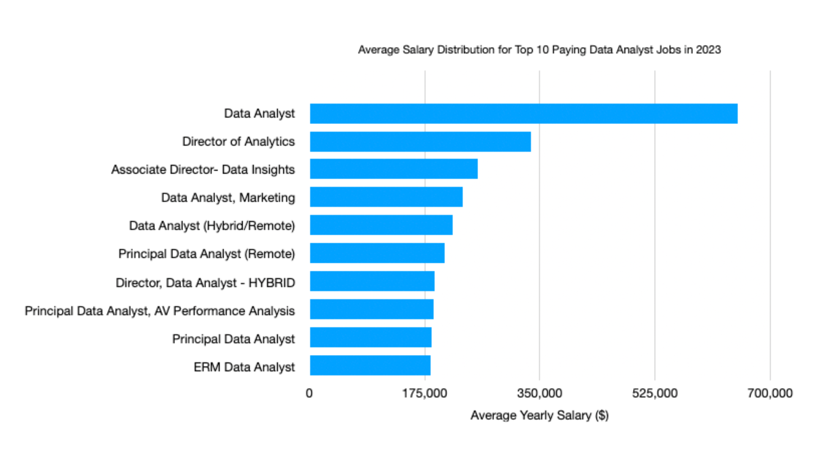
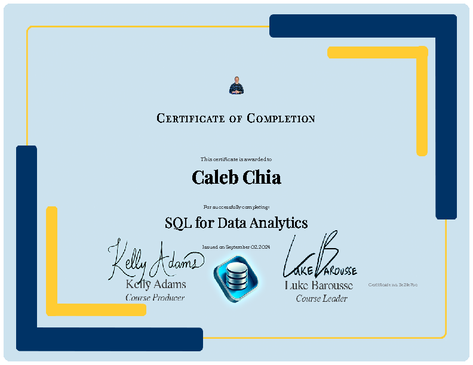

# Introduction
This repository is for me to display my SQL knowledge. Focusing on data analyst roles, this project explores top-paying jobs, in-demand skills, and where high demand meets high salary in data analytics.

SQL queries? Check them out here: [project_sql folder](/project_sql/).

# Background
I was looking through YouTube to learn about SQL and this is the project Luke Barousse taught. Data hails from my [SQL Course](https://lukebarousse.com/sql). It's packed with insights on job titles, salaries, locations, and essential skills. This repository was built to showcase my capabilities in basic and advanced SQL querying skills. For data visualization and data analysis, I currently depend on AI or my limited skills & knowledge to share what I can at this moment. 

### The questions I wanted to answer through my SQL queries were:
1. What are the top-paying data analyst jobs?
2. What skills are required for these top-paying jobs?
3. What skills are most in demand for data analyst?
4. Which skills are associated with higher salaries?
5. What are the most optimal skills to learn?

# Tools I used
- **SQL**: The backbone of my analysis, allowing me to query the database and unearth critical insights
- **PostgreSQL**: The chosen database management system, ideal for handling job posting data.
- **Visual Studio Code**: My go-to for database management and SQL queries
- **Git & GitHub**: Essential for version control and sharing my SQL scripts and analysis, ensuring collaboration and project tracking.

# The Analysis (A skill I am currently lacking)

### 1. Top-paying data analyst jobs
To identify the highest-paying roles, I filtered data analyst positions by average yearly salary and location, focusing on remote jobs. This query highlights the high paying opportunities in the field.

```sql
SELECT
    job_id,
    job_title,
    job_location,
    job_schedule_type,
    salary_year_avg,
    job_posted_date,
    name AS company_name
FROM
    job_postings_fact
LEFT JOIN company_dim ON job_postings_fact.company_id = company_dim.company_id
WHERE
    job_title_short = 'Data Analyst' AND
    job_location = 'Anywhere' AND
    salary_year_avg IS NOT NULL
ORDER BY
    salary_year_avg DESC
LIMIT 10;
```
Here's the breakdown of the top data analyst jobs in 2023:
- **Wide Salary Range:** Top 10 paying data analyst roles span from $184,000 to $650,000, indicating significant salary potential in the field.
- **Diverse Employers:** Companies like SmartAsset, Meta, and AT&T are among those offering high salaries, showing a broad interest across different industries.
- **Job Title Variety:** There's a high diversity in job titles, from Data Analyst to Director of Analytics, reflecting varied roles and specializations within data analytics.


*Bar graph visualizing the salary for the top 10 salaries for data analysts; created using Numbers on Mac*
-I do understand that at this point of time, I lack data visualizing skills and I plan to upskill myself on that portion. I won't be trying to display any data visualizing skills below anymore as I've yet to master them at this moment.


### 2. Skills Required for remote top-paying jobs
To identify the skills required for top-paying jobs, I created a Common Table Expression (CTE), which is the result set of a query which exists temporarily for me to filter the top paying Remote Data Analyst jobs. After which, I identified the skills that is tagged to those jobs.

 I filtered data analyst positions by average yearly salary and location, focusing on remote jobs. This query highlights the high paying opportunities in the field.

```sql
WITH top_paying_jobs AS (
    SELECT
        job_id,
        job_title,
        salary_year_avg,
        company_dim.name AS company_name
    FROM
        job_postings_fact
    LEFT JOIN company_dim ON job_postings_fact.company_id = company_dim.company_id
    WHERE
        job_title_short = 'Data Analyst' AND
        job_location = 'Anywhere' AND
        salary_year_avg IS NOT NULL
ORDER BY
    salary_year_avg DESC
LIMIT 10
)

SELECT
    top_paying_jobs.*,
    skills
FROM top_paying_jobs
INNER JOIN skills_job_dim ON top_paying_jobs.job_id = skills_job_dim.job_id
INNER JOIN skills_dim ON skills_job_dim.skill_id = skills_dim.skill_id
ORDER BY
    salary_year_avg DESC
```
Data Insights from ChatGPT:
-**High Demand for SQL:** SQL is the most frequently required skill across top-paying data analyst roles. It appears consistently across various job titles, indicating its critical importance in the data analytics field.
-**Diverse Skill Requirements:** In addition to SQL, other programming languages like Python, R, and tools such as Tableau, Excel, and Power BI are also frequently mentioned. 
This suggests that successful candidates need a broad skill set encompassing both programming and data visualization tools.
-**Cloud and Big Data Skills are Valued:** Skills related to cloud platforms (Azure, AWS) and big data processing (Databricks, Hadoop) are increasingly sought after, particularly in higher-paying roles. 
This reflects the industry's shift toward cloud computing and big data analytics.


### 3. What skills are most in demand for data analyst?
I utilized the aggregation function in SQL to count the number of skills required and filtered the data to only show Remote Data Analyst work to identify the top 5 most mentioned skills. 
Below shows the commands for my query.

```sql
SELECT
    skills,
    COUNT(skills_job_dim.job_id) AS demand_count
FROM job_postings_fact
INNER JOIN skills_job_dim ON job_postings_fact.job_id = skills_job_dim.job_id
INNER JOIN skills_dim ON skills_job_dim.skill_id = skills_dim.skill_id
WHERE
    job_title_short = 'Data Analyst' AND
    job_work_from_home = TRUE
GROUP BY
    skills
ORDER BY
    demand_count DESC
LIMIT 5;

```
As the insights are a repetition of what I did for previous two queries, I'll not be displaying them as the main purpose of this repository is to show that I have SQL skills.

### 4. Which skills are associated with higher salaries?
I found the average annual salary and rounded the numbers up to clean up the data. 
I also filtered the data as I only wanted to know what are the skills associated with top paying Data Analyst job.
Below shows the SQL commands I used to draw out the data I needed.

```sql
SELECT
    skills,
    ROUND(AVG(salary_year_avg), 0) AS avg_salary
FROM job_postings_fact
INNER JOIN skills_job_dim ON job_postings_fact.job_id = skills_job_dim.job_id
INNER JOIN skills_dim ON skills_job_dim.skill_id = skills_dim.skill_id
WHERE
    job_title_short = 'Data Analyst' AND
    salary_year_avg IS NOT NULL
GROUP BY
    skills
ORDER BY
    avg_salary DESC
LIMIT 25
```

### 5. What are the most optimal skills to learn?
The last query I had to go through in the course. However I feel that I've displayed my SQL knowledge sufficiently already. 
Therefore I shall not elaborate.

```sql
SELECT
    skills_dim.skill_id,
    skills_dim.skills,
    COUNT(skills_job_dim.job_id) AS demand_count,
    ROUND(AVG(job_postings_fact.salary_year_avg), 0) AS avg_salary
FROM
    job_postings_fact
INNER JOIN skills_job_dim ON job_postings_fact.job_id = skills_job_dim.job_id
INNER JOIN skills_dim ON skills_job_dim.skill_id = skills_dim.skill_id
WHERE
    job_title_short = 'Data Analyst'
    AND salary_year_avg IS NOT NULL
    AND job_work_from_home = TRUE
GROUP BY
    skills_dim.skill_id
HAVING
    COUNT(skills_job_dim.job_id) > 10
ORDER BY
    avg_salary DESC,
    demand_count DESC
LIMIT 25;
```

# What I learned
Through this course, I've learnt the Basics of SQL such as *SELECT, FROM, WHERE* to retreive the columns I need from the database. 
Following that, I've also learn Comparisons and Operations to manipulate data using *commands such as =, <>, >=, +. -, x, / and AS* to rename tables/columns.
Other basics such as Wildcards, Aggregation, NULL Values and JOINs allows me to manipulate data using commands such as *"LIKE, %, _, SUM, COUNT, AVG, GROUP BY, HAVING, IS NULL, IS NOT NULL, LEFT JOIN and INNER JOIN"*

I also learnt Advanced SQL skills such as:
[Data Types](postgresql.org/docs/current/datatype.html), Manipulate data using (CREATE, INSERT, ALTER, DROP) commands, Database Load which is a skill not shown here, DATEs such as (::DATE, AT TIME ZONE, EXTRACT), CASE Expression such as (CASE WHEN), Subqueries & CTEs using (WITH) command which as displayed above and lastly UNIONs to merge tables.

# Conclusions
This course was not without hiccups, I had to troubleshoot and resolve issues when the csv files did not load and when I was unable to connect to GitHub due to me making my email private.

I conclude that knowing SQL alone is not sufficient. I currently still lack the skills to tell a story with the data I've drawn out and am still not able to visualize the data. 
I plan to upskill myself on EXCEL, Tablaeu, PowerBI and perhaps Python for gain more Hard Skills. As for Softskills such as drawing insights from Data, I'll do up more reading along the way to make myself a more proficient Data Analyst that can value add to the business.

Besides SQL, I was given the opportunity to be exposed to platforms such as SQLite, Visual Studio Code (VSCode), GitHub. 
I also built this ReadMe from scratch through the guidance of Luke in this course. This proves my learning ability. 


*The Certificate that proves that I've completed the course by Luke Barousse*
